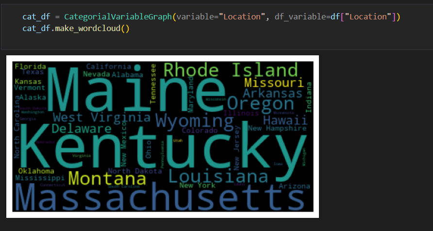
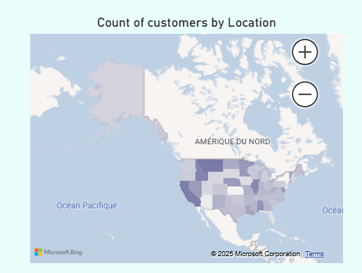

This project is an exploratory data analysis using a kaggle dataset

# Description
This project is meant to display basic EDA skills using jupiter notebook and powerBI. The notebook creates classes of methods to analyse the two different types of variables: quantivative and qualitative. Then classes are then used to answer hypothetical questions about the dataset such as "what is the avrage customer's age ?".
In the PowerBI dashborad, interactive visuals such as maps and graphs were crated. The data were imported as csv files in both tools.

# Ressources
The data set used is form the platform **kaggle:** https://www.kaggle.com/code/iamsouravbanerjee/decoding-customer-shopping-trends/input

# Analysis
## Jupiter notebook
The analysis was made using basic python data analysis libraries: numpy, pandas and matplotlib. Also wordlcloud was used to create particular visuals for the for the qualitative variables.
Example of a word clound displaying states names depending of the number of purshases in each one:

## PowerBI dashboard
Simple visuals of powerBI were used, along with filters.
Example a visual created: an iteractive map displaying the number of customers in each states.

